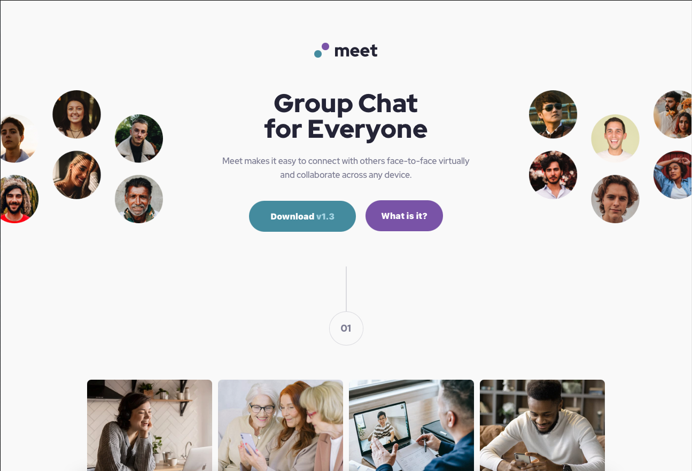

# Frontend Mentor | Meet Landing Page

Frontend Mentor challenge solution.   

Challenge link: [Frontend Mentor | Meet landing page coding challenge](https://www.frontendmentor.io/challenges/meet-landing-page-rbTDS6OUR)

## Table of contents

- [Overview](#overview)
  - [The Challenge](#the-challenge)
  - [Screenshot](#screenshot)
  - [Links](#links)
- [My process](#my-process)
  - [Built with](#built-with)
  - [What I learned](#what-i-learned)

## Overview

### The Challenge

Users should be able to:

- View the optimal layout depending on their device's screen size
- See hover states for interactive elements

### Screenshot

### Links

- Solution URL: [my-solution](https://www.frontendmentor.io/solutions/responsive-meet-landing-page-using-htmlcsssass-dWZL6AX4Q)
- Live Site URL: [live-solution](https://rafaacqv.github.io/meet-landing-page/)

## My Process

### Built with

- Semantic HTML5 / CSS3
- Sass (CSS preprocessor)
- Flexbox / Grid / Responsive Layout

### What I learned

In this challenge, I learned a lot about responsive layout, project structure and css position.
